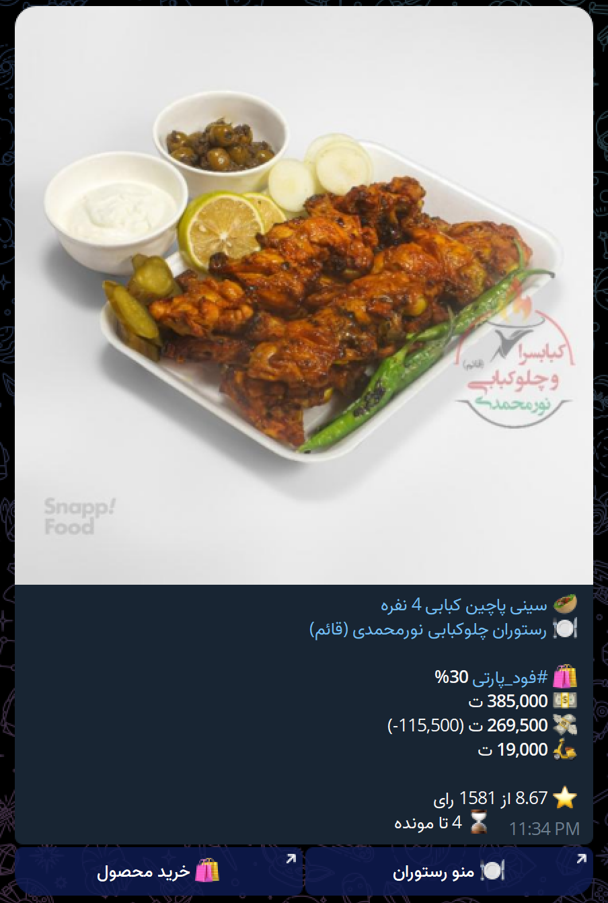

<div dir="rtl">

# گشنه

</div>

[English Version](README.md)

<div dir="rtl">

به گشنه خوش آمدید! دوست جدید شما در جستجوی تخفیفات خوشمزه. ما به اعماق وب سایت [Snappfood](https://snappfood.ir/) می‌رویم، با تخفیف‌ها (فودپارتی و سایر پارتی‌ها) مبارزه می‌کنیم و آن‌ها را مستقیماً به تلگرام شما ارسال می‌کنیم (در پیام‌های خصوصی شما یا یک کانال تلگرام به انتخاب شما). مناسب برای همه ماجراجویان غذایی و نینجاهای تخفیف! آماده شوید تا معاملات خوشمزه را کشف کنید و شادی را با شبکه خود به اشتراک بگذارید. شکار غذا آغاز می‌شود!

</div>




<div dir="rtl">

## نصب

برای راه‌اندازی گشنه، مراحل زیر را دنبال کنید:


### کلون کردن مخزن


ابتدا مخزن گشنه را به ماشین محلی خود کلون کنید. می‌توانید این کار را با اجرای فرمان زیر در ترمینال خود انجام دهید:

</div>

```bash
git clone https://github.com/ahbanavi/goshne.git
```


<div dir="rtl">

### کپی و تغییر فایل پیکربندی

سپس به دایرکتوری `config` بروید و یک کپی از فایل `config.local.yaml.example` بگیرید. کپی را به `config.local.yaml` تغییر نام دهید.

</div>

```bash
cd goshne/config
cp config.local.yaml.example config.local.yaml
```

<div dir="rtl">

فایل `config.local.yaml` را در ویرایشگر متن مورد علاقه خود باز کنید و مقادیر جایگزین را با مقادیر واقعی خود جایگزین کنید. به بخش [پیکربندی](#پیکربندی) برای جزئیات بیشتر مراجعه کنید.

### اجرای گشنه

#### با داکر


به دایرکتوری ریشه پروژه برگردید و فرمان زیر را برای شروع گشنه اجرا کنید:

</div>

```bash
cd ..
docker compose up -d # یا `docker-compose up -d` برای نسخه‌های قدیمی‌تر
```

<div dir="rtl">

گشنه اکنون با داکر در حال اجرا است!

پ.ن.: تنها دلیلی که من دستور به کلون کردن مخزن می‌دهم این است که فایل‌های `config.local.yaml.example` و `docker-compose.yaml` را دریافت کنید. اگر ترجیح می‌دهید مخزن را کلون نکنید، می‌توانید فقط این دو فایل را دانلود کنید و `volumes` در `docker-compose.yaml` را به مسیرهای صحیح تغییر دهید. ایمیج داکر در [بسته‌های گیت‌هاب](https://github.com/ahbanavi/goshne/pkgs/container/goshne) موجود است.

<div dir="rtl">

#### با پایتون

اگر ترجیح می‌دهید گشنه را بدون داکر اجرا کنید، مراحل زیر را دنبال کنید:

</div>

1. به دایرکتوری ریشه پروژه برگردید:

</div>

```bash
cd ..
```

<div dir="rtl">

2. یک محیط مجازی ایجاد کنید و آن را فعال کنید:

</div>

```bash
python3 -m venv venv
source venv/bin/activate # برای لینوکس و مک، یا از `venv\Scripts\activate.bat` برای cmd ویندوز و `venv\Scripts\Activate.ps1` برای پاورشل استفاده کنید.
```

<div dir="rtl">

3. بسته‌های پایتون مورد نیاز را نصب کنید:

</div>

```bash
pip3 install -r requirements.txt
```

<div dir="rtl">

4. گشنه را اجرا کنید:

</div>

```bash
python3 main.py
```

<div dir="rtl">

گشنه اکنون در حال اجرا است، می‌توانید در هر زمان با `Ctrl+C` آن را لغو کنید.

## پیکربندی

پیکربندی برنامه توسط `config.local.yaml.example` انجام می‌شود. برای استفاده از آن، فایل را کپی کرده و به `config.local.yaml` تغییر نام دهید.

در اینجا توضیح مختصری از پارامترهای پیکربندی آمده است:

</div>

```yaml
telegram:
    token: token # توکن ربات تلگرام شما. این مورد الزامی است و باید یک رشته باشد.
    endpoint: https://api.telegram.org/bot # نقطه پایانی برای سرور API ربات تلگرام. این مورد اختیاری است و به طور پیش‌فرض https://api.telegram.org/bot است. توکن ربات شما به این اضافه خواهد شد.

schedule:
    mins: 15 # فاصله زمانی به دقیقه که ربات تخفیف‌ها را بررسی می‌کند.

timeout: 10 # زمان انتظار برای درخواست‌های HTTP به ثانیه. این مورد اختیاری است و به طور پیش‌فرض 10 ثانیه است.

peoples: # حداقل یک نفر الزامی است.
    person_name: # نام شخصی که معاملات به او ارسال می‌شود. می‌تواند هر چیزی باشد و تأثیری بر عملکرد ربات ندارد، اما باید منحصر به فرد و رشته باشد.
        chat_id: chat_id # شناسه چت تلگرام که ربات معاملات را به آن ارسال می‌کند. این مورد الزامی است و باید عدد صحیح باشد، می‌توانید آن را با کمک https://t.me/username_to_id_bot پیدا کنید.
        lat: lat # عرض جغرافیایی برای مکان شخص. این مورد الزامی است.
        long: long # طول جغرافیایی برای مکان شخص. این مورد الزامی است.
        threshold: 30 # آستانه تخفیف. این مورد اختیاری است و به طور پیش‌فرض 0 است. اگر تنظیم شود، ربات فقط معاملات با تخفیف بیشتر یا مساوی با این مقدار را ارسال می‌کند.


    # افراد بیشتری می‌توانند در اینجا به همان فرمت بالا اضافه شوند.
```

<div dir="rtl">

مقادیر `token`، `person_name`، `chat_id`، `lat`، `long` و `threshold` را با مقادیر واقعی خود جایگزین کنید.

</div>
